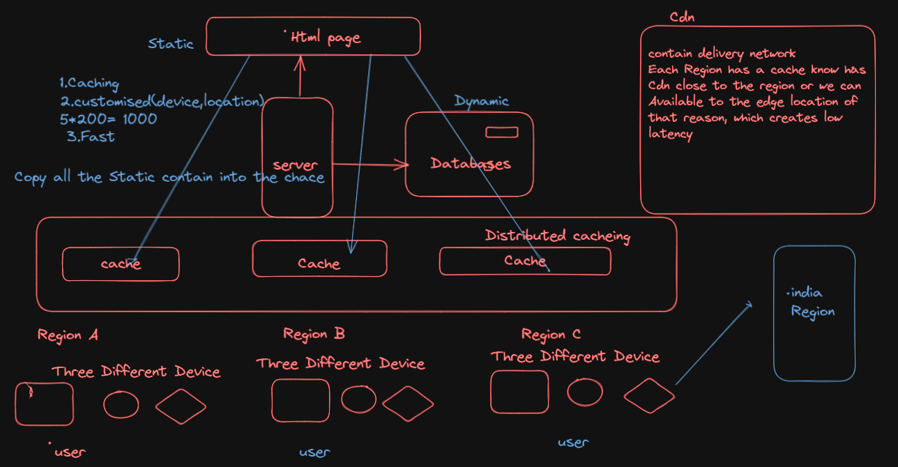

# Assignment 
- Create a heading tag using simple html.
- Create a heading using js DOM manupulation.
- Create a heading using React
- Create a little complex structure in React div.container>h1+h2

# Theory Question
1. What is Emmet?
  - **Emmet** is basically a plugin which is available in most of the text editor and it is bydefault  available in vscode.
  - **Emmet** has Some Abbreviation(which simple mean an expression or boilerplate),by using emmet which give a extra ease to developer to write the code much faster and in more effective way.
  - Ex with Expression
    1. > div.className
    2. >div{"Am inside the div"}
    3. >ul>li{$}*5
2. What is CDN and Cache?
  - **Cache** is type of temporary or short time memory, it is help to retrive data faster (which avoid to read data from original data source) rather save static and most use data copy into the memory.
  - **CDN**(contain Devlivery Network) it is generally a type of cache store the static contain.
  - Specializes of Cache
  - Hosting the static dataContainer closer to the user(Edge location)
  - Follow the Region Rule and regulation
  - Allow Posting content in the boxes Via ui.
  - Daigram
   

3. What is CrossOrigin Attribute?
   - By using the CrossOriginAttribute it trigger to mode of request to http cors request
   - **cors** cross origin request sharing is a mechanism which use addition http header to tell the brower wheater a specific web app share the resources with another web app.(both the orgin must be different)